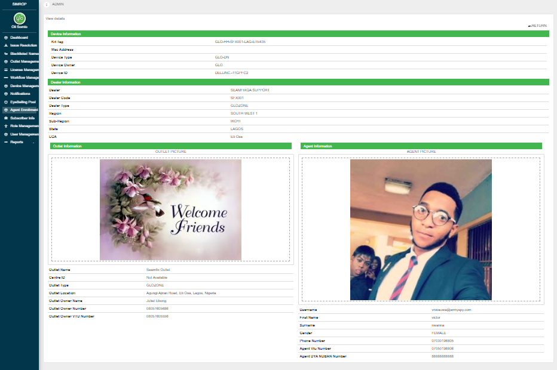
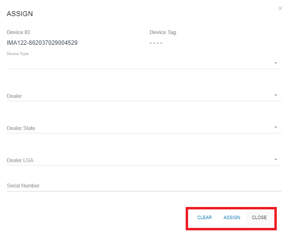
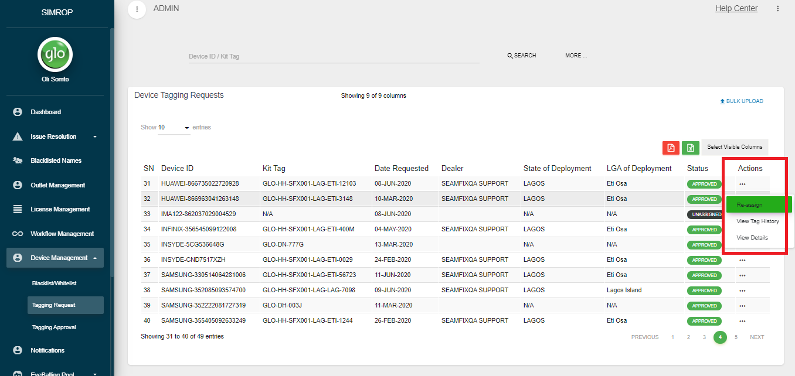
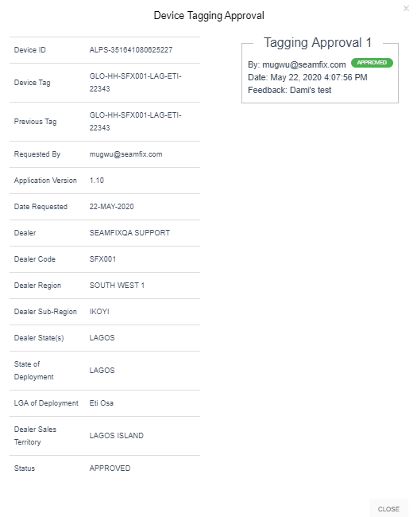
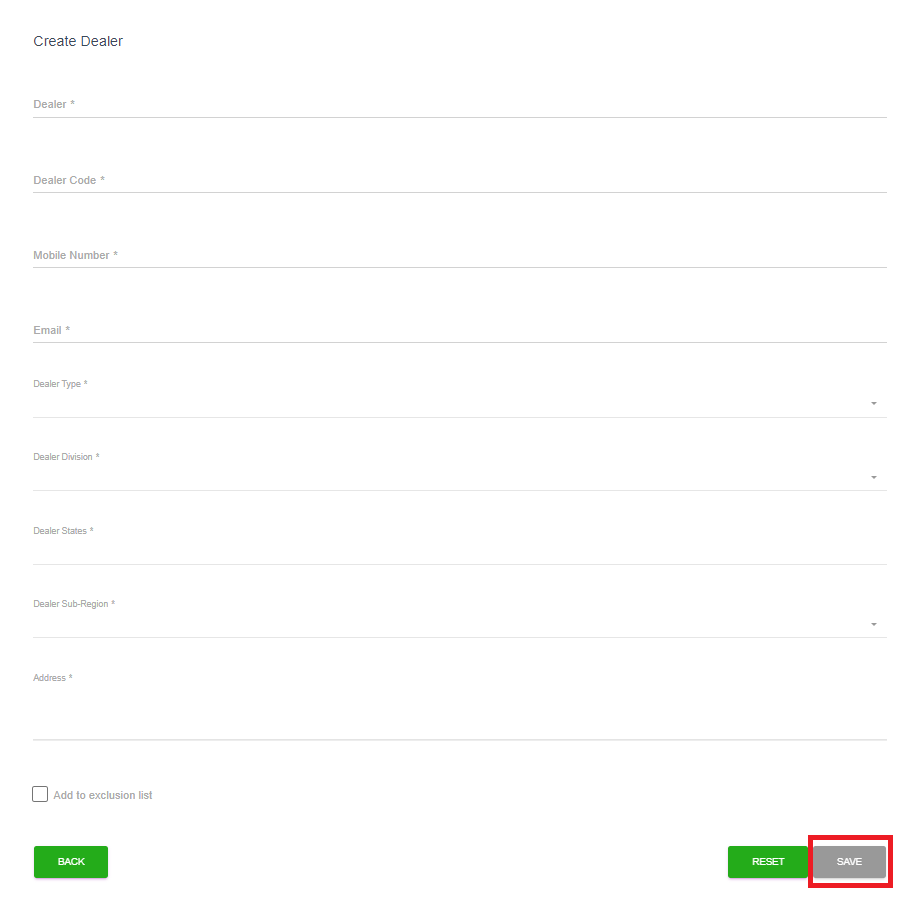
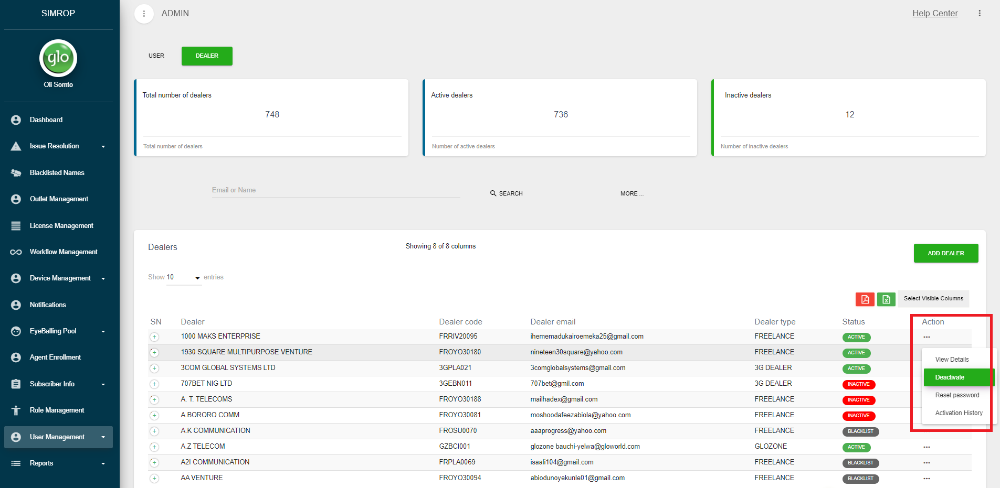
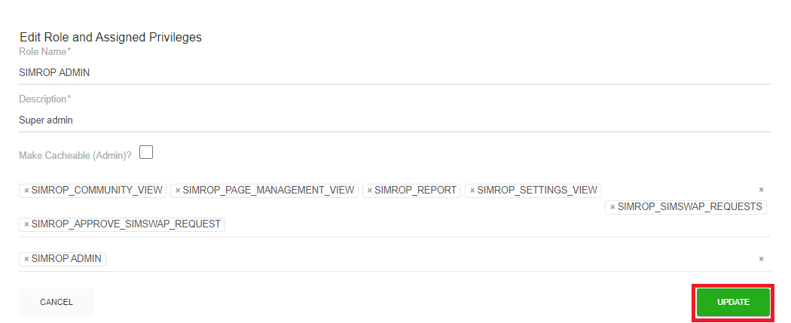
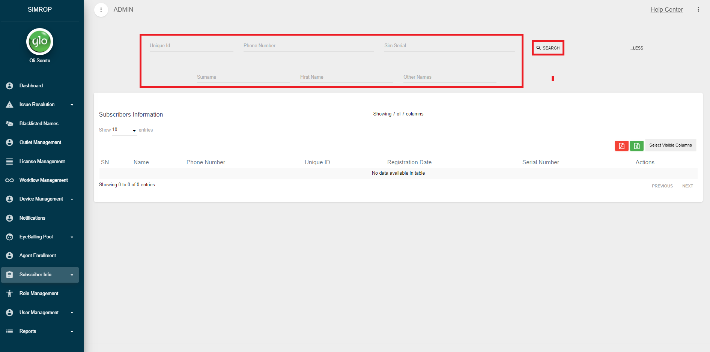
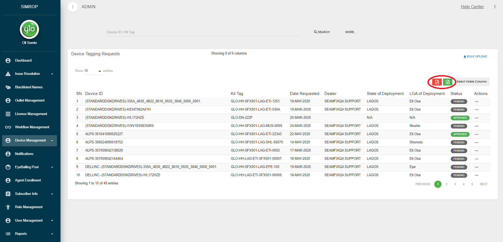

# CAC Admin Community

The CAC Admin view is a view accessible by CAC Admin or whoever that has the CAC Admin role on SIMROP. For a user to have access to the CAC Admin view, the user must request an account creation and the required role assigned to the user’s account. The dealer view has the following

## Dashboard

The dashboard has the analytics (in the form of graphs and charts) of all the dealer SIM registration and SIMROP activities. By default, the dashboard loads the analytics of all the dealers on SIMROP. However, each dealer’s analytics can be viewed by selecting the dealer from the KYC Dealer drop-down as shown in figure 26. The analytics on the dashboard includes; Kit activities, agent activities, registrations and SIMROP Operations. Also, the dashboard is the landing page for all users with CAC Admin role on SIMROP. Find the screenshot of the dealer dashboard in figure below:

Below is a list of analytics found on the dealer dashboard;
- **Kit Status:** A pie chart that displays a count of kits based on their status (whitelisted/blacklisted). CAC Admin can view more details by clicking on a section of the pie chart. The corresponding view shows a list of the devices that make up the count on the selected section.
-	**Monthly Kit Activity:** This chart shows the count of unique devices that have carried out at least one registration from the beginning of the month till the time dashboard was loaded.
-	**Total Agents:** This analytic shows a count of agents on KYC. However, when a dealer is selected from the KYC Dealer drop-down as shown in figure 26, the total agents would be that of the dealer selected from the drop-down.
- **Today’s Registration:** This analytic shows a count of registrations carried all the devices on the KYC ecosystem irrespective of the dealer. To get the count for registrations for a particular dealer, the user is expected to select the desired dealer from the KYC Dealer drop-down. The count shown is the total gross connection for the day the Dashboard was loaded.
-	**Today’s New Registration:** This analytic shows a count of new registration carried out by all the dealers or the selected dealer from the dealer dropdown
-	**Today’s Re-Registration:** This analytic shows a count of new registration carried out by all the dealers or the selected dealer from the dealer dropdown.
-	**Agent Status:** This is a pie chart that displays a distribution of active and inactive agents.
-	**Kit Assignment Status:** A pie chart that displays a distribution of all the agents mapped to a device against agents that have not been mapped to a device cumulatively. At a glance, a CAC admin is able to know the number of agents that are yet to be mapped to a device.
-	**Account Status:** A pie chart that tells a CAC Admin user the count of agents that accounts are locked and the count of agents that their accounts are not locked. This would enable the CAC Admin user to know the number of locked out agents at any given time.
-	**B2B Request:** On the dashboard, a dealer is able to know the overall status of B2B requests on SIMROP. At a glance, a CAC Admin user is able to know the count of Approved B2B requests, pending B2B requests and approved B2B requests.
-	**Issue Log:** On the dashboard, a CAC Admin user is able to know the overall status of Issue Log requests on SIMROP. At a glance, a CAC Admin is able to know the count of pending issues and the count of resolved issues on SIMROP
-	**Kit Activity Overview:** From this pie chart, a CAC Admin is able to view at a glance the count of devices that are active or inactive within his/her domain.
-	**Registration Overview:** On the dealer dashboard, the dealer is able to view the count of registrations carried out by devices mapped to him/her. The CAC Admin user has the option of generating weekly, daily, monthly or yearly registration overview from the CAC Admin dashboard. Also, the CAC Admin user can generate daily overview within a selected date range.
-	**Other Analytics:** A CAC Admin user can also see the following, they allow a CAC Admin user know the high and low performing dealers at a glance: 
    - Top 5 dealers 
    - Top 5 Users 
    - Least 5 Dealers 
    - Least 5 agents 

## Agent Enrollment Approval

From this view, a CAC Admin user is able to view details of Agent Enrollment (for new and existing agents) done by a dealer from the dealer’s view. CAC Admin users are alerted once a user maps a kit.

**Note:** Agent Enrollment Approval happens immediately a dealer is able to enrol an agent successfully.
Also, note that there is an approval workflow for Agent Enrollment Request for Non-Existing Agents/Users

To access the Agent Enrollment view, the CAC Admin User should, on successful login, click on the Agent Enrollment menu item on the SIMROP menu, this action navigates the dealer to Agent Enrollment landing page as shown in the image below:

***Note:** When there is an agent enrollment request from a dealer, the request is automatically approved by the system.*

### Search for existing Agent Enrollment

To search for existing Agent Enrollment, 

Visit the Agent Enrollment landing page
  -	Enter either the Kit tag or Device ID of the enrolled device
  -	Click on the Search button to display the result

Or
  -	Click on More button
  -	Select the desired search criteria from the listed drop-downs (CAC Admin user can select a dealer from the dealer drop-down)
  -	Click on the Search button to display the result

### View Mapping

To view Agent Enrollment, the dealer should;

-	Search for the required kit
-	Click on the Actions Button
-	Click on View Mapping Details

The actions above display the corresponding details of the kits as shown below;

### Approve Agent Enrolment (Non-Existing Agents)

To approve an Agent Enrolment request for non-existing agents, the admin is expected to do the following;

-	Search for the required kit
-	Click on the Actions Button
-	Click on View Mapping Details
-	The action above would display the view
-	Enter the approval reason
-	Click on the APPROVE button

If the request is approved, an account is created for the non-existing agent and the new agent account is mapped to the user. Also, a password is sent to the user on successful account creation.

## Issue Log View

On SIMROP, CAC Admins are able to resolve all issues logged by a dealer. When an issue is resolved, the dealer is alerted via email. Issue resolution can be done from 2 separate views;

### Kit Related Issues

To access the list of kit related issues logged by a dealer, a CAC Admin is expected to 
-	Login successfully to SIMROP
-	Click on Log Issues menu item. This action would drop down the sub-menu items
-	Click on Kit Issue Log. This action would bring up the Kit Issues landing page.

From the kit issues landing page, a CAC Admin user can carry out the following activities;

-	Search for an existing kit issue
-	View Details

#### Search for an existing kit issue

To search for an issue log sent in by a dealer, a CAC Admin user should do either of the following;
-	Enter an Issue ID or Kit Tag and click on Search
-	Select an Issue Summary and click on Search
-	Select an Issue Status, then, click on Search
-	Fill in all the fields with desired search criteria, then click on Search in order to narrow down the search result

#### View Details

On SIMROP, a CAC Admin user can view details an issue logged by a dealer;

-	Searching for an issue
-	Click on the Action menu
-	Click on View Details

#### Resolve Logged Issue

On SIMROP, a CAC Admin user can view details an issue logged by a dealer;

-	Follow the steps in **View Details** Section
-	Enter Resolution Feedback  
-	Click on Resolve 

### User Related Issues (CAC Admin View)

To access the list of user related issues logged by a dealer, a CAC Admin is expected to 
-	Login successfully to SIMROP
-	Click on Log Issues menu item. This action would drop down the sub-menu items
-	Click on User Issue Log. This action would bring up the User Issues landing page.

From the user issues landing page, a CAC Admin user can carry out the following activities;
- Search for existing user issue
-	View Details

#### Search for existing user issue

To search for an issue log sent in by a dealer, a CAC Admin user should do either of the following;
-	Enter an Issue ID or User Tag and click on Search
-	Select an Issue Summary and click on Search
-	Select an Issue Status, then, click on Search
-	Fill in all the fields with desired search criteria, then click on search in order to narrow down the search result

#### View Details

On SIMROP, a CAC Admin user can view details an issue logged by a dealer;
-	Searching for an issue
-	Click on the Action menu
-	Click on View Details

#### Resolve Logged Issue

On SIMROP, a CAC Admin user can view details an issue logged by a dealer;
-	Follow the steps in **View Details** Section
-	Enter Resolution Feedback
-	Click on Resolve

## B2B Request

From this view, a CAC Admin user is able to attend to B2B request. A CAC Admin user has to verify that the device logged as returned to B2B was actually returned to B2B before approval. However, a CAC Admin can choose not to approve a return to B2B request.

### B2B Request Landing Page

To visit a B2B Request landing page, a CAC Admin user is should;
-	Login successfully to SIMROP
-	Click on **B2B Request** from the SIMROP menu as shown in B2B 1

The actions above navigate the CAC Admin user to the B2B Request landing page as shown in B2B 2

<!-- theme: success -->
> ##### B2B 1
> B2B Request

<!-- theme: success -->
> ##### B2B 2
> B2B Request Landing Page

### Search B2B Requests

To search for a B2B Request sent in by a dealer, a CAC Admin user should do the following as shown in B2B 2;
-	Enter a **Kit Tag** then click on Search
-	Select a **Status**, then, click on Search

The actions above retrieve the B2B requests based on the search done as shown in B2B 3

### View Details

On SIMROP, a CAC Admin user can view details an issue logged by a dealer;
-	Searching for an issue as described in 4.4.1
-	Click on the Action menu as shown in B2B 3
-	Click on View Details as shown in B2B 3

The actions above displays the details of the B2B request as logged by the dealer as shown in B2B 4

<!-- theme: success -->
> ##### B2B 3
> View B2B Request Details

### Resolve B2B Request

On SIMROP, for a B2B request to be complete, an admin user must approve the request. Approval of B2B requests goes through a workflow (i.e. more than 1 admin can approve based on configuration). To approve a B2B request, an admin should;
 
-	Follow the steps in 4.4.1
-	Enter **Resolution Feedback** as shown in B2B 4
-	Click on **APPROVE** as shown in B2B 4

The dealer is alerted via email when a B2B request has been approved or rejected by a CAC Admin user.

Note that when the last approver approves, the device becomes blacklisted and is unmapped from the existing dealer. The unmapped device is automatically mapped to a virtual dealer called ‘Return to B2B’.

Also, if a request is rejected, the dealer is notified and the device would still be mapped to the already assigned dealer.

<!-- theme: success -->
> ##### B2B 4
> B2B Request Resolution View

## Device Management
The Device Management module is used to carry out all device related activities on SIMROP. Operations that can be carried out from the Device Management Module range from Tagging and Tagging Approval, Device requisition and Blacklist.

The Device Management view can be accessed from the SIMROP menu.

### Blacklist View
The Blacklist view is used to manage device status (blacklist and whitelist). Also, from the view, a user can see the count of the following in the SIM Registration ecosystem;
-	Total Kits
-	Blacklisted Kits
-	Whitelisted Kits

From Blacklist view, an admin can do the following;
-	Blacklist a Device
-	Whitelist a Device
-	View Kit Details

#### Blacklist a Device 
To blacklist a device, the admin should do the following
-	Click on Blacklist from Device Management on SIMROP menu to access the Blacklist landing page.
-	Search for the desired devices by entering the device Kit Tag or Mac Address
-	Click on the Action button
-	Click on Blacklist. 

-	Clicking on the Blacklist displays a modal that allows the user to enter the Blacklist Approver and the Blacklist Reason from the dropdown
-	Enter any other feedback as required
-	Click on the Save button. 

#### Whitelist a Device 
To whitelist a device, the admin should do the following
-	Click on Whitelist from Device Management on SIMROP menu to access the Whitelist landing page.
-	Search for the desired devices by entering the device Kit Tag or Mac Address
-	Click on the Action button
-	Click on Whitelist 

-	Clicking on the Whitelist displays a modal that allows the user to enter the Whitelist Approver and the Whitelist Reason from the Whitelist Reason dropdown
-	Enter the optional feedback on the feedback field
-	Click on the Save button. 

#### View Kit Details 

From the Blacklist View, a user can view kit details. The kit details have all the kit information as listed below;
-	Mobile Device Information
-	Device Location Information
-	Blacklist/Whitelist History
-	Device Location History
-	Kit Agents
-	Client Activity Summary
-	Registration Summary

To view the View Kit Details view, a user should do the following;

- Navigate to the Blacklist/Whitelist landing page
-	Click on the Action button
-	Click on View Details

The action above navigates the user to the View Kit Details view as shown below

#### Bulk Blacklist/Whitelist
A user can choose to blacklist/whitelist multiple kits all at once. This feature ensures that a user is able to whitelist/blacklist several kits in a single operation. To carry out a bulk device whitelist/backlist, a user should;
- Access the Blacklist view and click on Bulk Upload

-	Click on the Download Template link to download an complete the excel template
-	Upload the completed excel template
-	Click on the Upload button

### Tagging Request View

The Tagging Request view gives user visibility of all tagging request from devices. When a tagging request is made, the device details become visible to enable the user to tag the device on SIMROP. 

Actions that can be carried out from a Tagging Request view include
-	Search for Tagging Requests
-	Assign Devices
-	Re-Assign Devices
-	View Tag History
-	View Details

#### Search of Tagging Requests 
A user can search for a tagging request using the following parameters;
-	Device ID/Kit Tag
-	Dealers
-	Status
-	Start Date
-	End Date

***Note:** Some of the search parameters are hidden and can become visible by clicking the **More…** button

To search for a device tagging request, the user should do the following;
-	Navigate to the Tagging Request View from Device Management on the menu
-	Enter the Device ID/Kit tag of the desired device. Click on More… button to show more search options
-	Click on the Search button 

The action above displays the result based on the search criteria if there is a result of the search operation

#### Assign Device
Assigning of devices which are also known as device tagged can be done from the Tagging Request view. To assign a device;
-	Search for the desired device
-	Click on the Action button
-	Click on Assign to display a form containing kit tagging information

-	Select the desired parameters
-	Click on Assign

The actions above create a tag for the selected device. However, the tagging request needs to be approved. See Tagging Approval for more details

#### Re-Assign Device
A user can choose to Re-Assign an already assigned and approved device on SIMROP. Re-assigning occurs when the user wants to assign an already assigned kit to another dealer or another state. Re-assigning can be done from the Tagging Request view. To re-assign a device;

-	Search for the desired device
-	Click on the Action
-	Click on Re-Assign to display a form containing kit tagging information. Note: Re-Assign menu item is only available to already assigned/tagged devices that their status is Approved on SIMROP.

-	Select the desired parameters
-	Click on Re-Assign

The actions above create a tag for the selected device. However, the tagging request needs to be approved. See Tagging Approval for more details

#### View Tag History
To View Tag History, a user should
-	Navigate to the Tagging Request landing page
-	Click on the Action menu 
-	Click on View Tag History 

The action above displays all the tag history of the device as shown below

#### View Details
To view Tagging Request details, a user should
-	Navigate to the Tagging Request landing page
-	Click on the Action menu 
-	Click on View Details 

The action above displays the details of the device as shown below

### Tagging Approval View
The Tagging Approval view gives a user visibility of all tagging approval requests from devices. The approval of tagged devices is controlled by an approval chain called workflow. Refer to the Workflow Management section 

Actions that can be carried out from a Tagging Approval view include
-	Search for Tagging Approval Requests
-	View Details
-	View Tag History

#### Search of Tagging Approval Requests 
A user can search for a tagging approval request using the following parameters;
-	Device ID/Kit Tag
-	Dealers
-	Status
-	Start Date
-	End Date

**Note:** Some of the search parameters are hidden and can become visible by clicking the More… button

To search for a device tagging approval, the user should do the following;
-	Navigate to the Tagging Approval view from Device Management on the menu
-	Enter the Device ID/Kit tag of the desired device. Click on More… button to show more search options
-	Click on the Search button

The action above displays the result based on the search criteria if there is a result of the search operation

#### View Details
A user can view details of a tagging approval request and can also approve from the same view. Approval is configurable. This means that there could be more than 1 approver at a time based on configuration.

To Tagging Request details, a user should
-	Navigate to the Tagging Request Approval landing page
-	Click on the Action menu

-	Click on View Details 

The action above displays the details of the device as shown below

#### View Tag History
To View Tag History, a user should
-	Navigate to the Tagging Request landing page
-	Click on the Action menu 
-	Click on View Tag History 

The action above displays all the tag history of the device as shown below

## User Management Module
The User Management Module allows a user to manage other users and dealers on SIMROP. A user with access to the User Management Module 

### Access to the User Management Module
To access the user management module, do the following;
-	Login with a valid username and password
-	Click on User Management and click Account Creation
-	The action above navigates the user to the view shown below

### Account Creation 
To create an account on the User Management Module,
-	Access the User Management Module
-	Click on Add User

-	Click on User Creation. This action navigates the user to the account creation view as shown in the figure below
-	Enter the desired details in the form
-	Click on Save

**Note:** 
-	*When creating an account, use a unique email address. If an email already exists, a second account can’t be created using the same email address*
-	*All fields marked * must be completed to successfully create a user account.*
-	*Also, when creating user accounts, a unique phone number must be provided. A phone number that is mapped to an existing user is not unique and cannot be used to create the account*
-	*There are 2 types of users: Admin User and Agent User.*
-	*Admin users are users that are assigned administrative privileges and more than one dealer*
-	*An Agent user is assigned to just one dealer at a time.*

### Search, View and Edit
To search and view details of an existing user;
-	Enter the user’s name, email or phone number or status or Role
-	Click on Search
-	The action above bring up related results as shown below

-	Click on the Actions menu and select the View Details menu item as shown below to view the details of the selected record

-	Click on the Pencil icon to edit user detail

-	Update the desired field and click on Update

### Account Activation/Deactivation
When an account is deactivated, the user is unable to use any component of BioSmart or SIMROP that requires account login. To deactivate an account,
-	Access the User Management Module
-	Search for the account to be deactivated using user’s email, phone number or name
-	Click on the Actions menu and select Deactivate

-	Enter the approver of the Deactivation request on the Approval Email field
-	Enter Reason for deactivating account from the Approval Reason dropdown
-	Enter any other feedback as required

-	Click on Deactivate to complete the deactivation process

To activate a deactivated account;
-	Access the User Management Module
-	Search for the account to be deactivated using user’s email, phone number or name
-	Click on the Actions menu and select Activate

- Enter the approver of the activation request on the Approval Email field
-	Enter Reason for activating the account from the Approval Reason dropdown
-	Enter any other feedback as required

- Click on Activate to complete the activation process

### Password Reset
To reset an account;
-	Enter the user’s name, email or phone number and also select a status or Role from the user management landing page
-	Click on Search 
-	Click on the Actions menu on the selected record from the landing page
-	Click on Reset Password 

The user gets a new password as an SMS to user’s phone number

### Account Unlocking
 Accounts are usually blocked, due to security reasons, when a user enters the wrong password a defined number of times consecutively. To unlock a locked account;
-	Enter the user’s name, email or phone number and also select a status or Role from the User Management landing page
-	Click on Search 
-	Click on the Actions menu and select the Unlock Account menu item as shown below to view the details of the selected record 

### Bulk User Creation
An admin can create user accounts in bulk. To carry out a bulk account creation, the admin should
-	Access the User Management landing page
-	Click on the Add User > Bulk User Creation as shown below

-	Click on Download Template
-	Complete the downloaded template as required
-	Locate the file on the download path
-	Click on Upload

**Note:** On successful upload, a status report showing the state of each of the record is downloaded

### Bulk Activation/Deactivation
An admin can activate or deactivate user accounts in bulk. To carry out a bulk account activation/deactivation, the admin should
-	Access the User Management landing page
-	Click on the Add User > Bulk Activation/Deactivation as shown below

-	Click on Download Activation Template or Download Deactivation Template (the choice of the template depends on the type of operation to be performed)
-	Complete the downloaded template as required
-	Locate the file on the download path (or where the document is saved)
-	Click on Upload 

**Note:** On successful upload, a status report showing the state of each of the record is downloaded

### Bulk Password Reset
An admin can carry out password reset in bulk. To carry out a bulk password reset, the admin should
-	Access the User Management landing page
-	Click on the Add User > Bulk Password Reset as shown below

-	Click on Download Template
-	Complete the downloaded template as required
-	Locate the file on the download path
-	Click on Upload

**Note:** On successful upload, a status report showing the state of each of the record is downloaded

### Bulk User Update
An admin can carry out bulk user update. To carry out a bulk user update, the admin should
-	Access the User Management landing page
-	Click on the Add User > Bulk User Update as shown below

-	Click on Download Template
-	Complete the downloaded template as required
-	Locate the file on the download path
-	Click on Upload

**Note:** On successful upload, a status report showing the state of each of the record is downloaded

### Dealer Creation
An admin can also create dealers on SIMROP via the User Management Module. To create a dealer, an admin should do the following;

-	Access the User Management Module
-	Click on the Dealer button 
-	Click on the Add Dealer button 

- Enter the required details in the preceding form as shown below
- Click on Save to create dealer account 

### Search, View and Edit
To search and view details of an existing dealer account;
-	Enter the dealer’s name, email or phone number or status
-	Click on Search
-	The action above bring up related results
-	Click on the Actions menu and select the View Details menu item as shown below to view the details of the selected record

-	Update the desired field and click on Update

### Dealer Account Activation/Deactivation
To deactivate a dealer account,
-	Access the User Management Module
-	Search for the account to be deactivated using dealer’s email, phone number or name
-	Click on the Actions menu and select Deactivate

-	Enter the approver of the Deactivation request and the Reason for deactivating account

-	Click on Deactivate to complete the deactivation process

**Note:** The Deactivation Count (number of times the dealer has been deactivated) can be viewed while deactivating an active dealer

To activate a deactivated account;
-	Access the User Management Module
-	Search for the account to be deactivated using dealer’s email, phone number or name
-	Click on the Actions menu and select Activate

-	Enter the approver of the activation request and the Reason for deactivating account as shown below

-	Click on Activate to complete the activation process

### Dealer Account Password Reset
To reset the password to a dealer’s account;
-	Enter the dealer’s name, email or phone number and also select a status from the user management landing page
-	Click on Search 
-	Click on the Actions menu on the selected record from the landing page
-	Click on Reset Password 

The user gets a new password as an SMS to the user’s phone number with a notification on SIMROP.

### Dealer/User Account History

An admin is able to view either the user or dealer account activation history on SIMROP. To do this, the admin should;
-	Access the User Management Module
-	Access the User or Dealer sub-view as required
-	Search for the dealer or user from the selected view
-	Click on the Actions menu and select Activate

-	The action  below displays the activation/deactivation history of the user or dealer below

## License Request Management
License request from kits can be managed from the license request management module. 

### Access License Request
-	Login with a valid username and password
-	Click on License Management from the menu 
-	The action above navigates the user to the License Management view as shown below 

### Approve/Reject a License Request
-	Access the License Management view
-	Search for a license request by entering the Kit tag, mac address or email of the requesting agent in the search box as shown in the Figure below 

<!-- theme: success -->
> ##### FMLA 3
> Search License Request

- Click on Approve or Reject as shown in the Figure below 

<!-- theme: success -->
> ##### FMLA 4
> Approve/Reject License Request

OR
-	Click on the checkboxes by the license requests for approval or rejection as shown in the Figure below 

<!-- theme: success -->
> ##### FMLA 5
> Multiple License Approval

-	Click on Bulk License Approval button to approve all checked licenses.

OR
-	Click on the Download/Upload License Approval as shown in the Figure above
-	Download the License Approval Template by clicking on the Download Template button
-	Complete the template and upload

<!-- theme: success -->
> ##### FMLA 6
> Bulk License Upload

**Note:** A status report is downloaded showing the status of bulk license approval/rejection request.

## Role Management
This module is used to manage roles assigned to users on SIMROP. Roles on SIMROP are assigned privileges which determines the type of activity a user can carry out SIMROP.

###	Access to Role Manager
-	Login with a valid username and password
-	Go to the SIMROP menu and select Role Manager
-	The action above navigates the user to Role Management view as shown below 

### Add Role
Follow the steps below to add a new role
-	Access the landing page of the Role Management module
-	Click on the Add Role button 

-	Complete the form with the required details and click on Save

### View & Edit Role
-	Access the Role Management view
-	Enter the role name in the search field and click on the Search button

-	Click on Actions and select View Details 

-	Click on Edit as shown in the figure below 

-	Enter the required details and click on the Update button as shown in the figure below 

## Subscribers Module
The Subscriber allows a user with access to it to view details of any duly registered customer. 

### Access to Subscriber Module
-	Login successfully to SIMROP using the correct username and password
-	Go to the SIMROP Menu > Subscribers > Subscribers Info
-	The action above navigates the user to the Biodata Manager view as shown below 

### Search Subscriber Details
-	The user can search for a subscriber’s details as shown in the figure above by using either of the following;
    -	Subscriber’s Names (surname, first name or both)
    -	Subscriber’s phone number
    -	Subscriber’s registration unique ID or Serial number
-	Click on the Search button as shown in the figure above to spool a list of all registrations associated with the search criteria used as shown in the figure below

-	Click on Action > View Details of choice record to view the details associated with the registration as shown in the figure below

<!-- theme: success -->
> ##### BIO 48
> View Details

<!-- theme: success -->
> ##### BIO 49
> Bio Details View

-	Click on New Search as shown in the figure above to go back to the previous view to carry out a new search
-	Click on Print as shown in the figure above to print or export details to PDF

## VTU Management
VTU Management is a module that enables any admin with the required privilege to carry out VTU related management operations. The operations available to an admin on the VTU Management module include;

-	VTU Agent On-Boarding Request Approval
-	View VTU Dealer Dashboard
-	View Transaction History

VTU Management Module can be located on the menu as shown in VTUM 1 below;

<!-- theme: success -->
> ##### VTUM 1
> VTU Management Menu

### VTU On-Boarding Request Approval
Also, from the VTU Management module, the user can access the VTU On-Boarding Request Approval view. From this view, as shown in VTUM 8, a user is able to:
-	View & Approve Agent On-Boarding Request

#### View & Approve Agent On-Boarding Request
To view and approve an agent on-boarding request, the user should;
-	Click on VTU Management > VTU Onboarding Approval as shown in VTUM 1
-	Click on the Action > View Details button as shown in VTUM 2
-	The corresponding view shows the details of the Agent On-boarding request from the dealer as shown in VTUM 3
-	Enter the approval/rejection feedback and click on Approve/ Reject as shown in VTUM 3.

<!-- theme: success -->
> ##### VTUM 2
> Agent Approval View Details

<!-- theme: success -->
> ##### VTUM 3
> Approve VTU On-Boarding Request

#### Multiple Approval/Rejection
A user can choose to carry out multiple approval or rejection of Agent On-Boarding request. This feature ensures that a user is able to approve/reject several agents in a single operation. To carry out multiple approvals of agent on-boarding, a user should;
-	Access the VTU On-Boarding Approval view
-	Select the required requests by checking their respective check as shown in VTUM 4
-	Click on Approve Selected  or Approve Rejected as shown in VTU 4
-	Enter the Approval or Rejection Feedback in the corresponding view as shown in figure 5
-	Click on Approve or Reject to approve or reject the onboarding approval request.

<!-- theme: success -->
> ##### VTUM 4
> Multiple Approval / Rejection

<!-- theme: success -->
> ##### VTUM 5
> Multiple Approval/Rejection Reason

### VTU Dealer Dashboard
There is a VTU dashboard that is available to Admin Users on SIMROP. This dashboard has an overview of all vending carried out on BioSmart irrespective of the dealer. The dashboard comes with charts, counts and table. See a sample of the admin user VTU dashboard in VTUM 6

<!-- theme: success -->
> ##### VTUM 6
> VTU Admin Dashboard

The dealer dashboard has the following chart with their descriptions;
-	Total Airtime Amount – The total airtime amount of all the vends across all dealers
-	Total Data Amount – The total data amount of all the vends across all dealers
-	Successful Transactions – Total amount of successful transactions across all dealers
-	Failed Transactions – Total amount of failed transactions across all dealers
-	Transaction Distribution Airtime & Data – A bar chart showing a distribution of failed and successful airtime and data vend 
-	Transaction Distribution for Data Bundles – Distribution showing the count of the data types 

### Transaction History
The transaction history enables an admin user to have a visibility of all vending transactions carried out by agents mapped to dealers. The history is irrespective of if the transaction is failed or successful. The VTU Transaction History for airtime is shown in VTUM 7 while Transaction History for data is shown in VTUM 8.

<!-- theme: success -->
> ##### VTUM 7
> Admin Airtime transaction History

<!-- theme: success -->
> ##### VTUM 8
> Admin Data Transaction History

## Notifications
The notification feature is used to send messages or notifications to users in the field. Notifications can be either device targeted, user-targeted or global. A message targeted to a device can be viewed by any user that logs in to that device while a user targeted message can be viewed by only the user irrespective of the device they logged in to.

Below is a view of the Notifications landing page. 

The following actions can be carried out from the notification landing page;
-	Search for existing notifications
-	Send New Notification
-	View Notification Details

### Search for Existing Notifications
To search for existing notifications, the admin should do the following;
-	Click on Notifications from the Actions menu
-	Enter the desired search parameter
-	Click on the Search button

### Send New Notification
There are 2 methods of sending new notifications on SIMROP 
-	Single Notification
-	Bulk Notification

#### Single Notification
To send a single notification to a specified user or device, an admin is expected to do the following;
1.	Navigate to the landing page
2.	Click on the Notification button and select Single Notification button

3.	The action above displays the New Notifications dialog
4.	Select the target group (User, Dealers, Global) from the Select Target Group dropdown
5.	Select the Dealer, the Kit/User (depending on the target group), enter the message and click on the Save button 
6.	Proceed with Notification Creation and notification is displayed indicating that the notification sending was either successful or failed.

To send a Global Message, select Global from the Select Target Group dropdown and enter the message.
Click on the Save button. This action sends a message to all the kits on the BioSmart ecosystem.

#### Bulk Notification
Bulk notification can be used to send to several users or kits at a time. This can be done by downloading a template and uploading the complete template. On successful upload, a status report is downloaded automatically. The status report shows the notification items that were successful or not successful

To send a bulk notification, the admin should do the following;

1.	Navigate to the landing page 
2.	Click on the Notification button and select Bulk Notification button

3.	The action above displays the Notifications dialog
4.	Download the required template depending on the target group (devices or users) by clicking on the links as shown in the figure below
5.	Complete the downloaded template
6.	Select the completed and saved the template from the download location
7.	Click on the upload button.
8.	A status report is downloaded showing successful and failed notifications from the bulk notification operation.

### View Notification

An admin can also view details of a sent notification. To view notification details, an admin should do the following;
-	Access the Notification Module’s landing page
-	Search for the desired notification
-	Click on the Action button and select View Details 

-	The action above displays the details of the selected notification as shown below

## Kit Retrieval

This module enables an admin to have visibility of devices that have been retrieved from agents/users from their respect dealers. The admin does not carry out any action on this module. To view the details of a retrieved device, an admin should do the following;
-	Access the Kit Retrieval Module from the SIMROP menu
-	Search for the desired Kit Retrieval details
-	Click on View Details from the actions menu as shown in KITR 1 
-	The action above displays the details of the Kit Retrieval action performed by the dealer

<!-- theme: success -->
> ##### KITR 1
> Action Menu

<!-- theme: success -->
> ##### KITR 2
> View details

## Other SIMROP Actions

### Export Functionality
All SIMROP modules and views with tables have an export functionality. This means that the data available can be exported to either excel or pdf as desired. 

To export a report to excel, click on the excel icon in green as shown in the figure below and to export a report to pdf, click on the pdf icon in red as shown in the figure below.

**Note:** The export action only exports data visible to the admin at that time. i.e. the result on the screen is 50 of 500, only the 50 that is visible to the admin can be downloaded

### Column Visibility

Also, the number of columns visible to the admin on SIMROP can be controlled. This comes handy when there are too many columns for a given table and the admin wants to concentrate on a few columns. To select visible columns
-	On the view that has a table of results, click on the Select Visible Columns button 

-	Deselect the column name you want to be invisible and select the column you want to be visible
-	The action above automatically removes the deselected columns

## Help Center

The help centre has a list of frequently asked questions on SIMROP. This gives first-hand information about solutions to frequently reoccurring issues on SIMROP.

The help centre can be accessed even without logging in to SIMROP. This means that it is accessible if a user is logged in or not. 

To access the help centre, click on the Help Center link at the top right corner of the SIMROP page (logged in or not) as shown in the figure below. 

The action navigates the user to the corresponding FAQ page as shown in the figure below;

