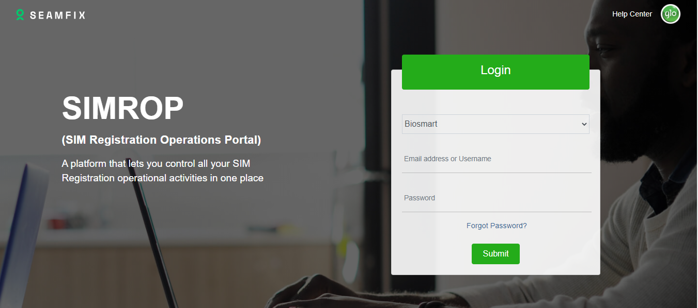
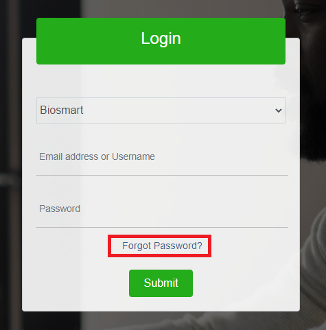
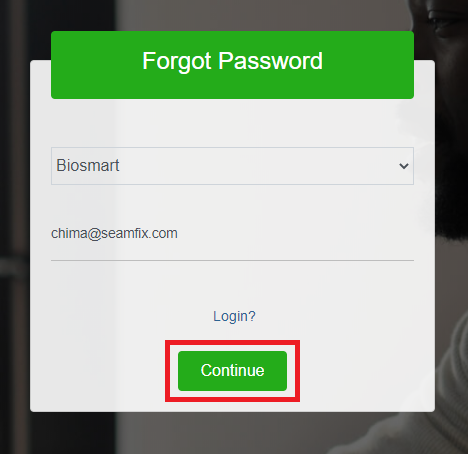
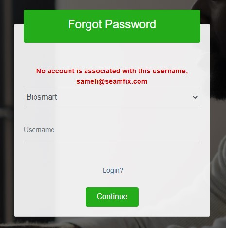

# Introduction

SIMROP also known as SIM Registration Operation Portal is a portal designed to manage kit assignment and other related activities. This portal can be used to manage kit assignment (map a kit to an agent), raise and resolve issues (issue log), log return B2B and approve/reject return B2B. Likewise, this portal provides stakeholders’ dashboards and reports for easy tracking and monitoring. 

> A primary goal of SIMROP is to enable flexibility of managing users and devices by Admins without coming in contact with the devices or users. Also, SIMROP ensures that most manual process are automated to ensure efficiency.

You can have visit [SIMROP](https://sraa.mtnnigeria.net/simrop) here.

The SIMROP portal has three categories of users, they are the:

- **Dealers:** These are dealers/partners with MTN Nigeria. On the SIMROP application, dealers are able to map devices to agents, log user and kit related issues, view SIMROP Dashboard, return devices to B2B and request for agent account creation.
- **Admins:** These are SIMROP admin. They receive notifications as a result of a request from dealers and get to act on the request. These group of users can view details of kit-agent mapping, act on B2B requests, resolve related issues and view Dashboard.

## SIMROP PORTAL

### Access to SIMROP
The new SIMROP can be accessed from http://sraa.mtnnigeria.net/ from a public network or from the MTN Domain. SIMROP can be accessed from any browser. The browser must have JavaScript enabled to enable SIMROP to run seamlessly. Below is a view of the landing page when a user visits the URL above

### Login

Before a user is able to login to SIMROP, an account must be created for the user. Actions and operations on SIMROP are highly role based. This means that a user is able to carry out actions on SIMROP based on the role assigned to the user. 
Account creation and role assignment to account are handled by CAC Helpdesk or Seamfix support. CAC Helpdesk can be reached on cacHelpDesk@mtn.com while Seamfix Support can be reached via email also on #seamfixsupport.NG@mtn.com

For a successful login, the user is expected to;
- Enter a valid username (email address)
- Enter a valid password
- Click on the Submit button as shown in the figure above

### Views
There are currently 3 views on SIMROP access to these views is dependent on the role assigned to the user. Below is a breakdown of the views;
- **Dealer View** – From this view, dealers are able to carry out all dealer related activities like; Agent Enrollment, Issue Log, retrieve devices, return devices to B2B and view dashboard. Note that dealers are able to view kits and carry out operations on kits assigned to them.
- **Admin View** – From this view, an Admin is able to carry out admin operations based on a request from dealers. Operations from this view include; retrieval of Agent Enrollment details, approval of Return to B2B requests, issue resolution, agent account creation, view dashboard

###	Password
SIMROP users have the ability to change their password at will. Password change or reset could be as a result of forgetting his/her password or a user wanting to change his/her password to something else.

To change a password, the user should do the following;
  - Access the login view
  - Click on the **Forgot Password** link as shown in the figure below

  - Enter the username/email to the account on the preceding screen and click on Continue

  -	If the provided username/email is not valid, an error message is returned as shown

  - Enter the OTP sent to the phone number associated with the account provided as shown below. 
**Note**: The last 4 digits of the number that would receive the MSISDN would be displayed on the screen as highlighted in the figure below. Also, note that the OTP sent to the user’s phone number expires after a configured amount of time
 

  - On successful validation of the OTP, the user would be prompted to provide a new password, confirm the provided password and click on Continue as shown in Figure 6. Note: The new password must conform to the configured password policy

 
> ### Figure 6
> Provide New Password

  - On successful validation, the new password is saved and the user is required to login with the new password

## 3.0 Dealer-Community

The dealer view is the view accessible by dealers on SIMROP. For a dealer to have access to view, the dealer must request for the creation of a dealer account and the required role assigned to the dealer account. The dealer view has the following;

### 3.1	Dashboard
The dashboard has the analytics (in form of counts, graphs and charts) of the logged in dealer’s: Kit activities, agent activities and SIMROP Operations. Also, the dashboard is the landing page for all dealers on SIMROP. Find the screenshot of the dealer dashboard Figure 1;

<!-- theme: danger --> 

> ##### Figure 1
> Dealer Dashboard 

Below is a list of analytics found on the dealer dashboard;
  - **Kit Status:** A pie chart that displays a count of kits based on their status (whitelisted/blacklisted). The dealer can view more details by clicking on a section of the pie chart. The corresponding view shows a list of the devices that make up the count on the selected section.
  - **Monthly Kit Activity:** This chart shows the count of unique devices that have carried out at least one registration from the beginning of the month till the time dashboard was loaded
  - **Total Agents:** This analytic shows a count of agents mapped to the dealer who is logged in.
  - **Today’s New Registration:** This analytic shows a count of new registration carried out by devices mapped to a logged dealer.
  - **Today’s Re-Registration:** This analytic shows a count of new registration carried out by devices mapped to a logged dealer.
  - **Today’s Registration:** This analytic shows a count of registrations carried out by devices mapped to the logged dealer. The count shown is the dealer’s gross connection for the day the Dashboard was loaded.
  - **Agent Status:** This is a pie chart that displays a distribution of active and inactive agents mapped to the logged in the dealer. 
  - **Kit Assignment Status:** A pie chart that displays a distribution of agents mapped to a device against agents that have not been mapped to a device. At a glance, the dealer is able to know the number of agents that are yet to be mapped to a device.
  - **Account Status:** A pie chart that tells a dealer the count of agents that their accounts are locked and the count of agents that their accounts are not locked. This would enable the dealer to know the number of locked out agents.
  - **B2B Request:** On the dashboard, a dealer is able to know the overall status of B2B requests on SIMROP. At a glance, a dealer is able to know the count of Approved B2B requests, pending B2B requests and approved B2B requests.
  - **Issue Log:** On the dashboard, a dealer is able to know the overall status of Issue Log requests on SIMROP. At a glance, a dealer is able to know the count of pending issues and the count of resolved issues on SIMROP
  - **Daily Kit Activity:** From this pie chart, the logged in the dealer is able to view at a glance the count of devices that are active or inactive within his/her domain for that day. The pie chart shows the count of unique active devices that are mapped to the dealer.
  - **Registration Overview: **On the dealer dashboard, the dealer is able to view the count of registrations carried out by devices mapped to him/her. The dealer has the option of generating weekly, daily, monthly or yearly registration overview from the dealer dashboard. Also, the dealer can generate daily overview within a selected date range.

### 3.2	VTU Management
VTU Management is a module that enables a dealer to carry out VTU related operations. The operations available to a dealer on the VTU Management module include;

  - VTU Agent On-Boarding Request
  - View VTU Dealer Dashboard
  - View Transaction History

VTU Management Module can be located on the menu as shown in Figure 1 below;

<!-- theme: danger --> 
> ##### Figure 2
> VTU Management Menu

#### **3.2.1		VTU On-Boarding Request**
Also, from the VTU Management module, the dealer can access the VTU On-Boarding Request view. From this view, as shown in VTU 8, a dealer is able to:

On-Board an agent for VTU on BioSmat
Deactivate an already active (and approved) agent
Activate an already inactive (and approved) agent

**3.2.1.1	On-Board Agent**
To onboard an agent for VTU (airtime/data), the dealer should;

  - Click on **VTU Management > Agent Onboarding** Request as shown in Figure 2
  - Click on the On-Board Agent button as shown in Figure 3
  - Enter the required details on the corresponding view as shown in Figure 4
  - Client on the Save button at the end of the page as shown in Figure 4.

The actions above save the record an notifies the configured users for approval

<!-- theme: danger --> 
> ##### Figure 3
> VTU Agent On-Boarding

<!-- theme: danger -->
> ##### Figure 4
> Save VTU On-Boarding Request

**3.2.1.2	Bulk Agent On-Boarding**

A dealer can choose to onboard multiple agents all at once. This feature ensures that a dealer is able to onboard several agents in a single operation. To carry out a multiple on-boarding of agents, a dealer should;

  - Access the VTU Agent On-Boarding view and click on Bulk Upload as shown in Figure 3
  - Click on the Download Template link (as shown in Figure 5) to download an complete the excel template
  - Upload the completed excel template
  - Click on the Upload button as shown in Figure 5

<!-- theme: danger --> 
> ##### Figure 5
> Bulk Agent On-Boarding

**3.2.1.3	View Agent On-Boarding Details**

A dealer can view the details of an already created agent on-boarding request. To view details of an agent on-boarding request, the dealer should
Access the VTU On-Boarding Request view as shown in Figure 3
Click on the Action button on the desired record
Click on View Details as shown in Figure 6 which displays the details of the agent on-boarding request as shown in Figure 7

<!-- theme: danger --> 
> ##### Figure 6
> Agent On-Boarding (View Details)
<!-- theme: danger --> 
> ##### Figure 7
> Agent On-Boarding Details

**3.2.1.4	Activate/Deactivate an Agent**
To activate/deactivate an agent, the dealer should;
  - Access the VTU On-Boarding Request view as shown in Figure 3
  - Click on the action button on the desired record to be activated/deactivated
  - Click on Activate or Deactivate to either activate or deactivate the agent as shown in Figure 8
  - Click on View Details to confirm the Activation Status of an Agent On-boarding request

<!-- theme: danger --> 
> ##### Figure 8
> Activate/Deactivate VTU

<!-- theme: danger --> 
> ##### Figure 9
> Agent Onboarind Activation Status

#### 3.2.2		VTU Dealer Dashboard
There is a VTU dealer dashboard that is available to dealers on SIMROP. This dashboard has an overview of all vending done by dealer’s agents. The dashboard comes with charts, counts and table. See a sample of the dealer VTU dashboard in Figure 10
<!-- theme: danger --> 
> ##### Figure 10
> VTU Dealer Dashboard

The dealer dashboard has the following chart with their descriptions;
  - **Total Airtime Amount** – The total airtime amount vend by agents mapped to the dealer
  - **Total Data Amount** – The total data amount vend by agents mapped to the dealer
  - **Successful Transactions** – Count of successful transactions carried out by agents mapped to the dealer
  - **Failed Transactions** – Count of failed transactions carried out by agents mapped to the dealer
  - **Transaction Distribution Airtime & Data** – A bar chart showing a distribution of failed and successful airtime and data vend by agents mapped to the dealer
  - **Transaction Distribution for Data Bundles** – Distribution showing the count of the data types vend by the agents mapped to the dealer
  - **Vending Distribution** – A distribution trend showing transaction of airtime and data in the past one week.

#### 3.2.3		Transaction History
The transaction history enables a dealer to have a visibility of all vending transactions carried out by agents mapped to the dealer. The history is irrespective of if the transaction is failed or successful. The VTU Transaction History for airtime is shown in Figure 11 while Transaction History for data is shown in Figure 12
<!-- theme: danger --> 
> ##### Figure 11
> Airtime transaction History

<!-- theme: danger --> 
> ##### Figure 12
> Data Transaction History

#### 3.2.4		View Details
To view the details of a Transaction History, the dealer should do the following
  - Click on Actions from the Transaction History view
  - Click on View Details as shown in Figure 12
  - The action above displays the details as shown in Figure 13

<!-- theme: danger --> 
> ##### Figure 13
> Transaction History View Details

<!-- theme: danger --> 
> ##### Figure 14
> View Details

### 3.3	Agent Enrollment
From this view, a dealer is able to assign or map an existing agent or a non-existing agent to a device. During this device-agent mapping operation, the dealer is required to provide other supporting details such as:

  - Dealer Details
  - Outlet details
  - Agent details including AYA, VTU number and ID card
  - Outlet Picture

As stated above, a dealer can enrol an existing agent or a non-existing agent. 

To access the Agent Enrollment view, the dealer should, on successful login, click on the Agent Enrollment menu item on the SIMROP menu as shown in Figure 1 below. This action navigates the dealer to Agent Enrollment landing page as shown in Figure 2 below

<!-- theme: danger --> 
> ##### Figure 1
> Agent Enrolment Menu

<!-- theme: danger -->
> ##### Figure 1
> Agent Enrollment View (Landing Page)

From the Agent Enrollment landing page as shown in Figure 2 above, the dealer is able to know if:

  - The kit is blacklisted or whitelisted
  - If a device marked as damaged, stolen or return
  - If an Agent Enrollment has been approved 

This operation enables the dealers and Admins to maintain a holistic database of devices and the agents that use them. From the device mapping view the dealer can;

  - Create a new Device-Agent mapping (Existing Agents)
  - Create a new Device-Agent mapping (Non-Existing Agents)
  - Search for an existing mapping
  - View Mapping
  - Retrieve Device
  - Make a B2B return request

#### 3.3.1	Create a new Device-Agent mapping (Existing Agents)

To create a new device-agent mapping, a dealer should;

  - Click on the New Kit Assignment button as shown in Figure 2 above
  - Select the Kit to be mapped from the Select Kit drop-down from the Device Tab as shown in Figure 3
  - Select other details as required
  - Click on Next to proceed to the next view
  - Enter the required dealer information as required from the Dealer Tab as shown in Figure 4
  - Click on Next to proceed to the Agent Information Tab
  - Select the agent to be mapped to the device from the Username drop-down as shown in Figure 5
  - Click on Submit to submit information to Admin as shown in Figure 5
  - If there is an existing agent enrollment request that is pending approval for the selected device, the user is notified as shown in the AVE 6.
  - Click on Proceed to proceed or Cancel to stop the Agent Enrollment Request process
  - On successful submission after clicking the Proceed button, the dealer gets a success message as shown in Figure 7

<!-- theme: danger -->
> ##### Figure 3
> Device Information for Mapping

<!-- theme: danger -->
> ##### Figure 4
> Dealer Information for Mapping

<!-- theme: danger -->
> ##### Figure 5
> Agent/Outlet Information for Mapping

<!-- theme: danger -->
> ##### Figure 6
> Agent Enrollment Confirmation Message

<!-- theme: danger -->
> ##### Figure 7
> Agent Enrollment Success Message

#### 3.3.2	Create a new Device-Agent mapping (Non-Existing Agents)

To create a new device-agent mapping for a non-existing agent, a dealer should;

  - Click on the **New Kit Assignment** button on the landing page as shown in Figure 2 above
  - Select the Kit to be mapped from the **Select Kit** drop-down on the **Device Tab** as shown in Figure 3
  - Select other details as required
  - Click on **Next** to proceed to the next view
  - Enter the required dealer information as required from the Dealer Tab as shown in Figure 4
  - Click on Next to proceed to the **Agent Information** view
  - Check the **New User?** Checkbox as shown in Figure 8

The actions above does the following as shown in Figure 9;
  - Disables the username field
  - Enables the following fields: First Name, Surname, Phone Number fields
  - Displays the Gender Field

<!-- theme: success -->
> **Note:** When the dealer enters the agent’s first name and surname, SIMROP Automatically generates a username in the format firstname.lastname@mtnagent.com for the dealer. If the generated name already exists, SIMROP adds a number to the generated username.

  - Enter the other information as required
  - Click on **Submit** to submit information to Admin as shown in Figure 5

    - _If there is an existing agent enrollment request that is pending approval for the selected device, the dealer is notified as shown in the Figure 6._
    - _If the phone number has been used to create an account for an existing agent, the dealer is notified as shown in Figure 10_
- Click on **Proceed** to proceed or **Cancel** to stop the Agent Enrollment Request process
- On successful submission after clicking the **Proceed** button, the dealer gets a success message as shown in Figure 7.

<!-- theme: success -->
> **Note**: After successful creation of Agent Enrollment Request for Non-Existing Agent, Admins are notified for Approval. The account is created after the admins have approved

 
<!-- theme: danger -->
> ##### Figure 8
> Initiate Enrollment for New Users

<!-- theme: danger -->
> ##### Figure 9
> Information for new Agent

 
<!-- theme: danger -->
> ##### Figure 10
> Existing Phone Number notification

#### 3.3.3	Search for existing Agent Enrollment
To search for existing Agent Enrollment, 

- Visit the Agent Enrollment landing page
- Enter the **Kit Tag** or **Device ID** as shown in Figure 11.
- Click on the **Search** button as shown in Figure 11 to display the result of the search based on the search details provided
Or
- Click on **More…** button which displays the list of searches as shown in Figure 11
- Select the desired search criteria from the listed drop-downs as shown in Figure 12
- Click on the **Search** button as shown in Figure 12 to display the result of the search based on the search criteria selected

 
<!-- theme: danger -->
> ##### Figure 11
>Search – Agent Enrolment

 
<!-- theme: danger -->
> ##### Figure 12
>More Search – Agent Enrollment

#### 3.3.4	View Mapping

To view Agent Enrollment, the dealer should;

- Search for the required kit (Refer to 3.3.3)
- Click on the **Actions** button as shown in Figure 13
- Click on **View Details** as shown in Figure 13
- The actions above display the corresponding details of the kits as shown in Figure 14

 
<!-- theme: danger -->
> ##### Figure 13
> – Agent Enrolment – View Details Menu Item

 
<!-- theme: danger -->
> ##### Figure 13
> Agent Enrolment – View Details

#### 3.3.4	Retrieve Device
A dealer is able to retrieve a device from an agent. A retrieved device is automatically blacklisted and cannot be re-assigned to another agent until the device has been whitelisted. To retrieve a device, the dealer should

- Search for the required kit (Refer to 3.3.3)
- Click on the **Actions** Button as shown in Figure 15
- Click on **Retrieve Kit** as shown in Figure 15
- Select the retrieval reason from the **Retrieval Reason** dropdown as shown in Figure 16
- Click on **Retrieve Kit** as shown in Figure 16
- On successful retrieval, the status of the device changes from ***Whitelisted*** to ***Blacklisted***.

<!-- theme: success -->
> **Note:** *Dealer must make sure the device is retrieved from the agent physically before carrying out the retrieval action on SIMROP.*

 
<!-- theme: danger -->
> ##### Figure 15
> Agent Enrolment – Retrieve Kit Menu Item

 
<!-- theme: danger -->
> ##### Figure 16
> Kit Retrieval Dialog

#### 3.3.4	Make a B2B return request
A dealer can also return devices to B2B on SIMROP. When a device is returned to a B2B location, the dealer should notify Admin by making a return to B2B request. To make a return to B2B request on SIMROP, the dealer should

- Search for the required kit (Refer to 3.3.3)
- Click on the **Actions** Button as shown in Figure 17
- Click on **Return to B2B** as shown in Figure 17.
- Select and enter the required details from the **Return to B2B dialog** box
- Enter the **Reason** why the device was returned to B2B as shown in Figure 18 below
- Upload device image 
- Click on the **Send** button

 
<!-- theme: danger -->
> ##### Figure 17
>  Agent Enrollment – Return to B2B Menu Item

 
<!-- theme: danger -->
> ##### Figure 18
> B2B Location, Reason and Image Upload

The action above triggers an email notification to the approvers (based on the roles) who verifies that the device was actually returned to B2B before approving. Approving B2B requests passes through an approval workflow. This means that more than one person can approve based on the approval configuration

Note that devices approved by Admin Helpdesk as returned to B2B are automatically blacklisted and are removed from the list of kits mapped to that dealer.

### 3.4	Issue Log View

On SIMROP, dealers are now able to log all kit and user related issues on SIMROP. This is to enable the seamless tracking of issues to ensure tracking and subsequent closure. All user and kit related issues are assigned an issue ID which can be used for tracking status of an issue. Issues can be logged from 2 separate views;

#### 3.4.1	Kit Related Issues

To log a kit related issues, a dealer is expected to 
- Login successfully to SIMROP
- Click on **Log Issues** menu item. This action would drop down the sub-menu items
- Click on **Kit Issue Log** as shown in Figure 1. This action would bring up the **Kit Issues** landing page as shown in Figure 1

 
<!-- theme: danger -->
> ##### Figure 1
> Kit Issue Log Menu

 
<!-- theme: danger -->
> ##### Figure 2
> Kit Issues Landing Page

From the kit issues landing page, a dealer can carry out the following activities;

- Log Kit Issue
- Search for an existing kit issue
- View Details

**3.4.1.1	Log Kit Issue**

To log a new kit issue, the dealer should;

- Click on Log **Kit Issue** button as shown in Figure 2
- Select the affected kit from the **Kit Tag** drop-down as shown in Figure 3
- Select the issue summary from the **Issue Summary** drop-down as shown in Figure 3
- Enter the description of the issue in the ***Description fiel*d** as shown in figure Figure 3
- Click on **Send**.

The actions above alert the Admin Helpdesk via email for issue resolution

 
<!-- theme: danger -->
> ##### Figure 3
> Log Kit Related Issue

**3.4.1.2	Search for an existing kit issue**
To search for an existing kit issue, a dealer should do either of the following as shown in Figure 2;
- Enter an **Issue ID** or **Kit Tag** and click on Search
- Select an **Issue Summary** and click on **Search**
- Select an **Issue Status**, then, click on **Search**
- Fill in all the fields with desired search criteria, then click on search in order to narrow down the search result

**3.4.1.3	View Details**
On SIMROP, dealers can view details of an already created Kit Issue Log by;

- Searching for an issue as described in 
- Click on the **Action** menu as shown in Figure 4
- Click on **View Details** as shown in Figure 4

 
<!-- theme: danger -->
> ##### Figure 4
> View Details (Issue Log)

The actions above displays the details of the issue logged, resolution message,who resolved the issue and resolution date if the issues have been resolved by Admin Helpdesk. See an example of a resolved kit issue log in Figure 5

 
<!-- theme: danger -->
> ##### Figure 5
> View Logged Issues with Resolution Details

#### 3.4.2	User Related Issues

To log a user related issue, a dealer is expected to 
- Login successfully to SIMROP
- Click on **Log Issues** menu item. This action would drop down the sub-menu items
- Click on **User Issue Log** as shown in Figure 6. This action would bring up the **User Issues** landing page as shown in Figure 7.

 
<!-- theme: danger -->
> ##### Figure 6
> User Issue Log

 
<!-- theme: danger -->
> ##### Figure 7
> User Issues Landing Page

From the user issues landing page, a dealer can carry out the following activities;

1. Log User Issue
2. Search for existing User issue
3. View Details

**3.4.2.1	Log User Issue**

To log a new User issue, the dealer should;

- Click on **Log User Issue** button as shown in Figure 7
- Select the affected user from the **Username** drop-down as shown in Figure 8
- Select the issue summary from the **Issue Summary** drop-down as shown in Figure 8
- Enter the description of the issue in the **Description field** as shown in Figure 8
- Click on **Send**.

The actions above alert the Admin Helpdesk via email for issue resolution

 
<!-- theme: danger -->
> ##### Figure 8
> Log User Related Issue

**3.4.2.2	Search for an existing kit issu**e
To search for an existing user issue, a dealer should do either of the following as shown in figure 7;
•	Enter an **Issue ID** or **Username** and click on **Search**
•	Select an **Issue Summary** and click on **Search**
•	Select an **Issue Status**, then, click on **Search**
•	Fill in all the fields with desired search criteria, then click on search in order to narrow down the search result

**3.4.2.3	View Details**
On SIMROP, dealers can view details of an already created User Issue Log by;

•	Searching for an issue as described in 
•	Click on the Action menu as shown in Figure 9
•	Click on View Details as shown in Figure 9

 
<!-- theme: danger -->
> ##### Figure 9
> View Details (User Issue Log)

The actions above displays the details of the issue logged, resolution message,who resolved the issue and resolution date if the issues have been resolved by Admin Helpdesk. See an example of a resolved user issue log in Figure 10

 
<!-- theme: danger -->
> ##### Figure 10
> View Logged User Issues with Resolution Details

### 3.6	Device Requisition
From this module, a dealer can make a device requisition request. The dealer can only request a specific count of devices to be deployed to a defined area. 

From the module, a dealer can;
- Make a device requisition request
- Edit a requisition request
- View Request

#### 3.6.1		Device Requisition Request
To make a Device Requisition Request, a dealer should;
- Access the Device Requisition Landing page as shown in Figure 1
- Click on the New Device Requisition button
- Complete the form the comes after the action above 
- Click on the Send button as shown in Figure 2

 
<!-- theme: danger -->
> ##### Figure 1
>  Device Requisition Landing Page

 
<!-- theme: danger -->
> ##### Figure 2
> New Requisition Form

#### 3.6.2		View a Request
To view the details of an existing request, the dealer should;
- Navigate to the landing page as shown in Figure 1
- Click on the Action button
- Click on View Details as shown in Figure 3. 
- This action displays the details of the selected device requisition request as shown in Figure 4

<!-- theme: success -->
> **Note**: *The Requisition Details view has other details like the approver’s feedback*

 
<!-- theme: danger -->
> ##### Figure 3
> View Details Action

 
<!-- theme: danger -->
> ##### Figure 4
> Requisition Details View

