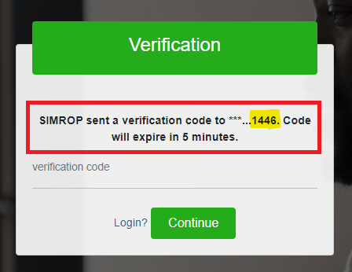

# SIMROP PORTAL

## Access to SIMROP
The new SIMROP can be accessed from http://sraa.mtnnigeria.net/ from a public network or from the MTN Domain. SIMROP can be accessed from any browser. The browser must have JavaScript enabled to enable SIMROP to run seamlessly. Below is a view of the landing page when a user visits the URL above

## Login

Before a user is able to login to SIMROP, an account must be created for the user. Actions and operations on SIMROP are highly role based. This means that a user is able to carry out actions on SIMROP based on the role assigned to the user. 
Account creation and role assignment to account are handled by CAC Helpdesk or Seamfix support. CAC Helpdesk can be reached on cacHelpDesk@mtn.com while Seamfix Support can be reached via email also on #seamfixsupport.NG@mtn.com

For a successful login, the user is expected to;
- Enter a valid username (email address)
- Enter a valid password
- Click on the Submit button as shown in the figure above

## Views
There are currently 3 views on SIMROP access to these views is dependent on the role assigned to the user. Below is a breakdown of the views;
- **Dealer View** – From this view, dealers are able to carry out all dealer related activities like; Agent Enrollment, Issue Log, retrieve devices, return devices to B2B and view dashboard. Note that dealers are able to view kits and carry out operations on kits assigned to them.
- **Admin View** – From this view, an Admin is able to carry out admin operations based on a request from dealers. Operations from this view include; retrieval of Agent Enrollment details, approval of Return to B2B requests, issue resolution, agent account creation, view dashboard

###	Password
SIMROP users have the ability to change their password at will. Password change or reset could be as a result of forgetting his/her password or a user wanting to change his/her password to something else.

To change a password, the user should do the following;
  - Access the login view
  - Click on the **Forgot Password** link as shown in the figure below

  - Enter the username/email to the account on the preceding screen and click on Continue

  -	If the provided username/email is not valid, an error message is returned as shown

  - Enter the OTP sent to the phone number associated with the account provided as shown below. 
**Note**: The last 4 digits of the number that would receive the MSISDN would be displayed on the screen as highlighted in the figure below. Also, note that the OTP sent to the user’s phone number expires after a configured amount of time
 

  - On successful validation of the OTP, the user would be prompted to provide a new password, confirm the provided password and click on Continue as shown in Figure 6. Note: The new password must conform to the configured password policy

 
> ### Figure 6
> Provide New Password

  - On successful validation, the new password is saved and the user is required to login with the new password

